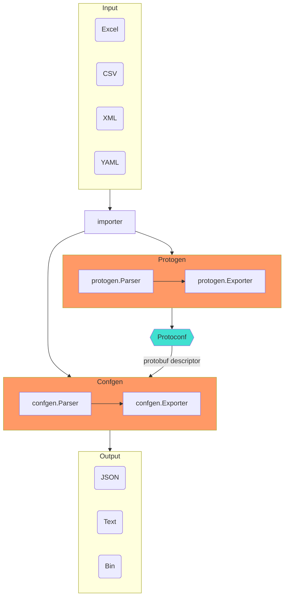

## Features

- Convert **Excel/CSV/XML/YAML** to **JSON/Text/Bin**, JSON is the first-class citizen of exporting targets.
- Use **Protobuf** to define the structure of **Excel/CSV/XML/YAML**.
- Use **Golang** to develop the conversion engine.
- Support multiple programming languages, thanks to **Protobuf (proto3)**.

## Concepts

- Importer: Excel/CSV/XML/YAML importer.
- IR: Intermediate Representation.
- Filter: filter the IR.
- Exporter: JSON, Text, and Bin.
- Protoconf: a configuration metadata format based on protobuf.

## Workflow

## Types

- Scalar
- Message(struct)
- List
- Map(unordered)
- Timestamp
- Duration

## TODO

### protoc plugins

- [x] Golang
- [x] C++
- [ ] C#/.NET
- [ ] Python
- [ ] Lua
- [ ] Javascript/Typescript/Node
- [ ] Java

### Metadata

- [ ] metatable: a message to describe the worksheet's metadata.
- [ ] metafield: a message to describe the caption's metadata.
- [x] captrow: caption row, the exact row number of captions at worksheet. **Newline** in caption is allowed for more readability, and will be trimmed in conversion.
- [ ] descrow: description row, the exact row number of descriptions at worksheet.
- [x] datarow: data row, the start row number of data.

[Newline](https://www.wikiwand.com/en/Newline)(line break) in major operating systems:

| OS                  | Abbreviation | Escape sequence |
|---------------------|--------------|-----------------|
| Unix (linux, OS X)  | LF           | `\n`            |
| Microsoft Windows   | CRLF         | `\r\n`          |
| classic Mac OS/OS X | CR           | `\r`            |

> **LF**: Line Feed, **CR**: Carriage Return.
>
> [Mac OS X](https://www.oreilly.com/library/view/mac-os-x/0596004605/ch01s06.html)

### Generator

- [x] generate protoconf by Excel(header): **Excel -> protoconf**
- [ ] generate Excel(header) by protoconf: **protoconf -> Excel**

### Conversion

- [x] Excel -> JSON(default format and human readable)
- [x] Excel -> protowire(small size)
- [x] Excel -> prototext(human debugging)
- [ ] JSON -> Excel
- [ ] protowire -> Excel
- [ ] prototext -> Excel

### Pretty Print

- [x] Multiline: every textual element on a new line
- [x] Indent: 4 space characters
- [x] JSON support
- [x] prototext support

### EmitUnpopulated

- [x] JSON: `EmitUnpopulated` specifies whether to emit unpopulated fields.

### Scalar Types

- [x] interger: int32, uint32, int64 and uint64
- [x] float: float and double
- [x] bool
- [x] string
- [x] bytes
- [x] datetime, date, time, duration

### Enumerations

- [x] enum: The Parser accepts three enum value forms:
  - enum value number
  - enum value name
  - enum value alias name (with EnumValueOptions specified)
- [x] enum: validate the enum value.

### Composite Types

- [x] message: horizontal(row direction) layout, fields located in cells.
- [x] message: simple in-cell message, each field must be **scalar** type. It is a comma-separated list of fields. E.g.: `1,test,3.0`. List's size need not to be equal to fields' size, as fields will be filled in order. Fields not configured will be filled default values due to its scalar type.
- [x] list: horizontal(row direction) layout, which is list's default layout, and each item can be **message** or **scalar**.
- [x] list: vertical(column direction) layout. and each item should be **message**.
- [x] list: simple in-cell list, element must be **scalar** type. It is a comma-separated list of elements. E.g.: `1,2,3`.
- [x] list: scalable or dynamic list size.
- [x] list: smart recognition of empty element at any position.
- [x] list
  - [ ] In-cell struct list: no need to support
  - [x] Cross-cell horizontal scalar/enum list
  - [x] Cross-cell horizontal incell-struct list
  - [ ] Cross-cell vertical scalar list: no need to support, use this: `[Item]int32`
  - [x] Cross-cell vertical incell-struct list
- [x] list size
  - [x] dynamic size: items should be present continuously, and report error if empty item is inserted.
  - [x] fixed size
- [x] map: horizontal(row direction) layout.
- [x] map: vertical(column direction) layout, and is map's default layout.
- [x] map: unordered-map or hash-map.
- [ ] map: ordered-map supported by [tableauio/loader](https://github.com/tableauio/loader).
  - [x] C++
  - [ ] Golang
  - [ ] C#
- [x] map: simple in-cell map, both key and value must be **scalar** type. It is a comma-separated list of `key:value` pairs. E.g.: `1:10,2:20,3:30`.
- [x] map: scalable or dynamic map size.
- [x] map: smart recognition of empty value at any position.
- [x] map
  - [ ] Cross-cell horizontal scalar map: no need to support, use this: `map<int32, Item>`
  - [ ] Cross-cell vertical scalar map: : no need to support, use this: `map<int32, Item>`
- [x] map size
  - [x] dynamic size: items should be present continuously, and report error if empty item is inserted.
  - [x] fixed size
- [x] nesting: unlimited nesting of message, list, and map.
- [ ] nesting: the composite type's first element can be composite type.

### Default Values

Each scalar type's default value is same as protobuf.

- [x] interger: `0`
- [x] float: `0.0`
- [x] bool: `false`
- [x] string: `""`
- [x] bytes: `""`
- [x] in-cell message: each field's default value is same as protobuf
- [x] in-cell list: element's default value is same as protobuf
- [x] in-cell map: both key and value's default value are same as protobuf
- [x] message: all fields have default values

### Empty

- [x] scalar: default value same as protobuf.
- [x] message: empty message will not be spawned if all fields are empty.
- [x] list: empty list will not be spawned if list's size is 0.
- [x] list: empty message will not be appended if list's element(message type) is empty.
- [x] map: empty map will not be spawned if map's size is 0.
- [x] map: empty message will not be inserted if map's value(message type) is empty.
- [x] nesting: recursively empty.

### Merge

- [ ] merge multiple workbooks
- [ ] merge multiple worksheets

### Workbook meta

workbook meta sheet **@TABLEAU**:

- specify which sheets to be parsed
- specify parser options for each sheet

| Sheet  | Alias        | Nameline | Typeline |
|--------|--------------|----------|----------|
| Sheet1 | ExchangeInfo | 2        | 2        |

### Datetime

> [Understanding about RFC 3339 for Datetime and Timezone Formatting in Software Engineering](https://medium.com/easyread/understanding-about-rfc-3339-for-datetime-formatting-in-software-engineering-940aa5d5f68a)
>
> `2019-10-12T07:20:50.52Z # This is acceptable in ISO 8601 and RFC 3339 (with T)`
> `2019-10-12 07:20:50.52Z # This is only accepted in RFC 3339 (without T)`
>
> - "Z" stands for **Zero timezone** or **Zulu timezone** `UTC+0`, and equal to `+00:00` in the RFC 3339.
> - **RFC 3339** follows the **ISO 8601** DateTime format. The only difference is RFC allows us to replace "T" with "space".

Use [RFC 3339](https://tools.ietf.org/html/rfc3339) , which is following [ISO 8601](https://www.wikiwand.com/en/ISO_8601).

- [x] Timestamp: based on `google.protobuf.Timestamp`, see [JSON mapping](https://developers.google.com/protocol-buffers/docs/proto3#json)
- [x] Timezone: see [ParseInLocation](https://golang.org/pkg/time/#ParseInLocation)
- [ ] DST: Daylight Savings Time. *There is no plan to handle this boring stuff*.
- [x] Datetime: excel format: `yyyy-MM-dd HH:mm:ss`, e.g.: `2020-01-01 05:10:00`
- [x] Date: excel format: `yyyy-MM-dd` or `yyMMdd`, e.g.: `2020-01-01` or `20200101`
- [x] Time: excel format: `HH:mm:ss` or ``HHmmss``, e.g.: `05:10:00` or `051000`
- [x] Duration: based on`google.protobuf.Duration` , see [JSON mapping](https://developers.google.com/protocol-buffers/docs/proto3#json)
- [x] Duration: excel format: `form "72h3m0.5s"`, see [golang duration string form](https://golang.org/pkg/time/#Duration.String)
  
### Transpose

- [x] Interchange the rows and columns of a worksheet.

### Validation

- [x] unique: check map key uniqueness.
- [x] range: `[left, right]`.
- [ ] refer: `XXXConf.ID`. To be supported by [tableauio/loader](https://github.com/tableauio/loader).

### Error Message

- [ ] Report clear and precise error messages when converter failed, please refer to the programming language compiler
- [ ] Use golang template to define error message template
- [ ] Multiple languages support, focused on English and Simplified Chinese

### Performace

- [ ] Stress test
- [ ] Each goroutine process one worksheet
- [ ] Mutiple process model
