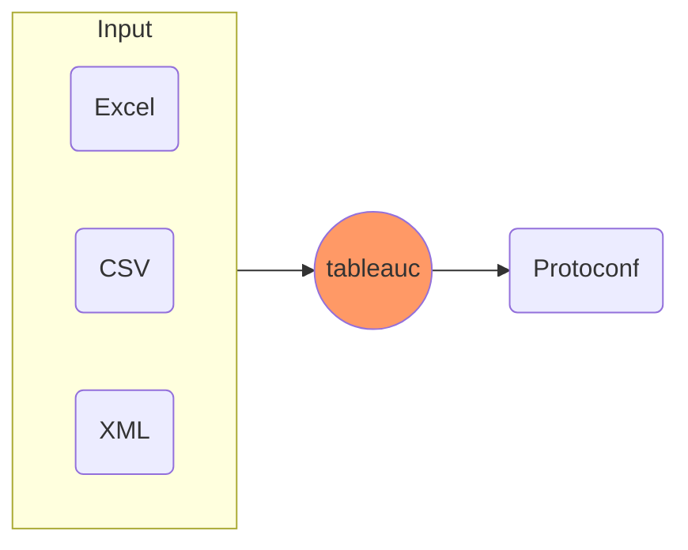
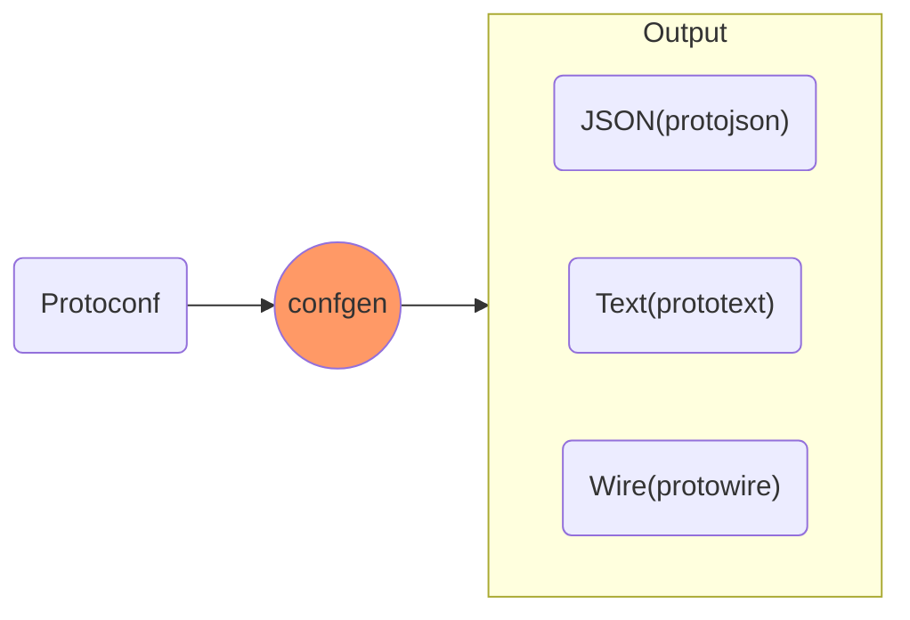

## Get started

### tableauc (protogen)

The `tableauc` is the tableau compiler with **protogen** inside, which can convert **Excel/CSV/XML** files to **Protoconf** files.
**Protoconf** is a dialect of [Protocol Buffers (proto3)](https://developers.google.com/protocol-buffers/docs/proto3) extended with [tableau options](https://github.com/tableauio/tableau/blob/master/proto/tableau/protobuf/tableau.proto), aimed to define the structure of Excel/CSV/XML.

### confgen

