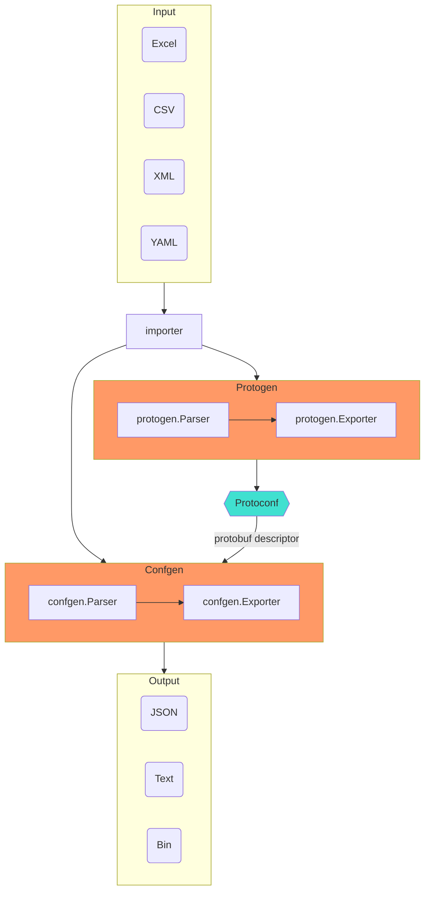

## 特性

- 将 **Excel/CSV/XML/YAML** 转换为 **JSON/Text/Bin**。
- 使用 **Protobuf** 定义 **Excel/CSV/XML/YAML** 的结构。
- 使用 **Golang** 开发转换引擎。
- 支持多种编程语言，得益于 **Protobuf (proto3)**。

## 概念

- 导入器（Importer）：
  - 将 **Excel/CSV** 文件导入到内存中的 **Table** 工作表簿。
  - 将 **XML/YAML** 文件导入到内存中的 **Document** 工作表簿。
- 解析器（Parsers）：
  - protogen：将 **Excel/CSV/XML/YAML** 文件转换为 **Protoconf** 文件。
  - confgen：将 **Excel/CSV/XML/YAML** 与 **Protoconf** 文件转换为 **JSON/Text/Bin** 文件。
- 导出器（Exporter）：
  - protogen：将 [tableau.Workbook](https://github.com/tableauio/tableau/blob/master/proto/tableau/protobuf/workbook.proto) 导出为 proto 文件。
  - confgen：将 protobuf message 导出为 **JSON/Text/Bin** 文件。
- Protoconf：[Protocol Buffers (proto3)](https://developers.google.com/protocol-buffers/docs/proto3) 的方言，扩展了 [tableau 选项](https://github.com/tableauio/tableau/blob/master/proto/tableau/protobuf/tableau.proto)，旨在定义 Excel/CSV/XML/YAML 的结构。

## 工作流程

## 类型

- 标量
- 消息（结构体）
- 列表
- 字典（无序）
- 时间戳
- 持续时间

## 待办事项

### protoc 插件

- [x] Golang
- [x] C++
- [ ] C#/.NET
- [ ] Python
- [ ] Lua
- [ ] Javascript/Typescript/Node
- [ ] Java

### 元数据

- [ ] metatable：用于描述工作表元数据的 message。
- [ ] metafield：用于描述标题元数据的 message。
- [x] captrow：标题行，工作表中标题的确切行号。为了更好的可读性，允许在标题中使用换行符，并在转换时进行修剪。
- [ ] descrow：描述行，工作表中描述的确切行号。
- [x] datarow：数据行，数据开始的行号。

主要操作系统中的 [换行符](https://www.wikiwand.com/en/Newline)（换行）：

| 操作系统               | 缩写   | 转义序列 |
| ---------------------- | ------ | -------- |
| Unix (linux, OS X)     | LF     | `\n`     |
| Microsoft Windows      | CRLF   | `\r\n`   |
| classic Mac OS/OS X    | CR     | `\r`     |

> **LF**：换行，**CR**：回车。
>
> [Mac OS X](https://www.oreilly.com/library/view/mac-os-x/0596004605/ch01s06.html)

### 生成器

- [x] 通过 Excel（header）生成 protoconf：**Excel -> protoconf**
- [ ] 通过 protoconf 生成 Excel（header）：**protoconf -> Excel**

### 转换

- [x] Excel -> JSON（默认格式和人类可读）
- [x] Excel -> protowire（小尺寸）
- [x] Excel -> prototext（人类调试）
- [ ] JSON -> Excel
- [ ] protowire -> Excel
- [ ] prototext -> Excel

### 美化打印

- [x] 多行：每个文本元素在新行上
- [x] 缩进：4 个空格字符
- [x] JSON 支持
- [x] prototext 支持

### EmitUnpopulated

- [x] JSON：`EmitUnpopulated` 指定是否发出未填充的字段。

### 标量值

- [x] 整数：int32、uint32、int64 和 uint64
- [x] 浮点数：float 和 double
- [x] bool
- [x] string
- [x] bytes
- [x] datetime、date、time、duration

### 枚举

- [x] enum：解析器接受三种枚举值形式：
  - 枚举值数字
  - 枚举值名称
  - 枚举值别名名称（指定了 EnumValueOptions）
- [x] enum：验证枚举值。

### 复合类型

- [x] message：水平（行方向）布局，字段位于单元格中。
- [x] message：简单单元格内消息，每个字段必须是**标量值**类型。它是字段的逗号分隔列表。例如：`1,test,3.0`。列表的大小不必等于字段的大小，因为字段将按顺序填充。未配置的字段将由于其标量值类型而被填充为默认值。
- [x] list：水平（行方向）布局，这是列表的默认布局，每个项目可以是**消息**或**标量**。
- [x] list：垂直（列方向）布局，每个项目应该是**消息**。
- [x] list：简单单元格内列表，元素必须是**标量**类型。它是元素的逗号分隔列表。例如：`1,2,3`。
- [x] list：可扩展或动态列表大小。
- [x] list：智能识别任意位置的空元素。
- [x] list
  - [ ] 单元格内结构体列表：无需支持
  - [x] 跨单元格水平标量/枚举列表
  - [x] 跨单元格水平单元格内结构体列表
  - [ ] 跨单元格垂直标量列表：无需支持，使用这个：`[Item]int32`
  - [x] 跨单元格垂直单元格内结构体列表
- [x] list 大小
  - [x] 动态大小：项目应连续出现，如果插入空项目则报告错误。
  - [x] 固定大小
- [x] map：水平（行方向）布局。
- [x] map：垂直（列方向）布局，这是字典的默认布局。
- [x] map：无序字典或哈希字典。
- [ ] map：由 [tableauio/loader](https://github.com/tableauio/loader) 支持的有序字典。
  - [x] C++
  - [ ] Golang
  - [ ] C#
- [x] map：简单单元格内字典，键和值都必须是**标量**类型。它是 `key:value` 对的逗号分隔列表。例如：`1:10,2:20,3:30`。
- [x] map：可扩展或动态字典大小。
- [x] map：智能识别任意位置的空值。
- [x] map
  - [ ] 跨单元格水平标量字典：无需支持，使用这个：`map<int32, Item>`
  - [ ] 跨单元格垂直标量字典：：无需支持，使用这个：`map<int32, Item>`
- [x] map 大小
  - [x] 动态大小：项目应连续出现，如果插入空项目则报告错误。
  - [x] 固定大小
- [x] 嵌套：消息、列表和字典的无限制嵌套。
- [ ] 嵌套：复合类型的第一个元素可以是复合类型。

### 默认值

每个标量值类型的默认值与 protobuf 相同。

- [x] 整数：`0`
- [x] 浮点数：`0.0`
- [x] bool：`false`
- [x] string：`""`
- [x] bytes：`""`
- [x] 单元格内消息：每个字段的默认值与 protobuf 相同
- [x] 单元格内列表：元素的默认值与 protobuf 相同
- [x] 单元格内字典：键和值的默认值与 protobuf 相同
- [x] message：所有字段都有默认值

### 空

- [x] 标量：默认值与 protobuf 相同。
- [x] message：如果所有字段都为空，则不会生成空消息。
- [x] list：如果列表大小为 0，则不会生成空列表。
- [x] list：如果列表的元素（消息类型）为空，则不会追加空消息。
- [x] map：如果字典大小为 0，则不会生成空字典。
- [x] map：如果字典的值（消息类型）为空，则不会插入空消息。
- [x] 嵌套：递归为空。

### 合并

- [ ] 合并多个工作簿
- [ ] 合并多个工作表

### 工作簿元数据

工作簿元数据表 **@TABLEAU**：

- 指定要解析的工作表
- 为每个工作表指定解析器选项

| 工作表 | 别名        | Nameline | Typeline |
| ------ | ---------- | -------- | -------- |
| Sheet1 | ExchangeInfo | 2        | 2        |

### 日期时间

> [关于 RFC 3339 在软件工程中用于日期时间和时区格式的理解](https://medium.com/easyread/understanding-about-rfc-3339-for-datetime-formatting-in-software-engineering-940aa5d5f68a)
>
> `2019-10-12T07:20:50.52Z # 这在 ISO 8601 和 RFC 3339 中是可接受的（带 T）`
> `2019-10-12 07:20:50.52Z # 这仅在 RFC 3339 中可接受（不带 T）`
>
> - "Z" 代表**零时区**或**祖鲁时区** `UTC+0`，在 RFC 3339 中等于 `+08:00`。
> - **RFC 3339** 遵循 **ISO 8601** 日期时间格式。唯一的区别是 RFC 允许我们用空格替换 "T"。

使用 [RFC 3339](https://tools.ietf.org/html/rfc3339)，它遵循 [ISO 8601](https://www.wikiwand.com/en/ISO_8601)。

- [x] 时间戳：基于 `google.protobuf.Timestamp`，请参阅 [JSON 映射](https://developers.google.com/protocol-buffers/docs/proto3#json)
- [x] 时区：请参阅 [ParseInLocation](https://golang.org/pkg/time/#ParseInLocation)
- [ ] DST：夏令时。*没有计划处理这个无聊的东西*。
- [x] 日期时间：excel 格式：`yyyy-MM-dd HH:mm:ss`，例如：`2020-01-01 05:10:00`
- [x] 日期：excel 格式：`yyyy-MM-dd` 或 `yyMMdd`，例如：`2020-01-01` 或 `20200101`
- [x] 时间：excel 格式：`HH:mm:ss` 或 ``HHmmss``，例如：`05:10:00` 或 `051000`
- [x] 持续时间：基于 `google.protobuf.Duration`，请参阅 [JSON 映射](https://developers.google.com/protocol-buffers/docs/proto3#json)
- [x] 持续时间：excel 格式：`form "72h3m0.5s"`，请参阅 [golang 持续时间字符串形式](https://golang.org/pkg/time/#Duration.String)
  
### 转置

- [x] 交换工作表的行和列。

### 验证

- [x] 唯一性：检查字典键的唯一性。
- [x] 范围：`[left,right]`。
- [ ] 引用：`XXXConf.ID`。将由 [tableauio/loader](https://github.com/tableauio/loader) 支持。

### 错误消息

- [ ] 当转换器失败时，报告清晰而精确的错误消息，请参阅编程语言编译器
- [ ] 使用 golang 模板定义错误消息模板
- [ ] 多语言支持，专注于英语和简体中文

### 性能

- [ ] 压力测试
- [ ] 每个 goroutine 处理一个工作表
- [ ] 多进程模型
