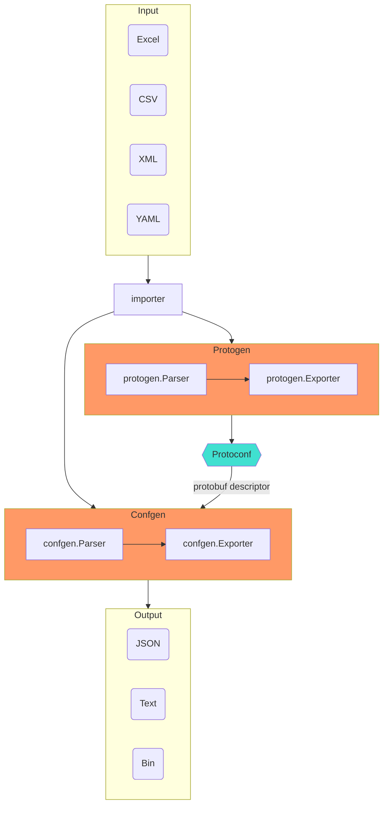

## 特性

- 将 **Excel/CSV/XML/YAML** 转换为 **JSON/Text/Bin**。
- 使用 **Protobuf** 定义 **Excel/CSV/XML/YAML** 的结构。
- 使用 **Golang** 开发转换引擎。
- 得益于 **Protobuf (proto3)**，支持多种编程语言。

## 概念

- Importer（导入器）：
  - 将 **Excel/CSV** 文件导入为内存中的 **Table** sheet 集合。
  - 将 **XML/YAML** 文件导入为内存中的 **Document** sheet 集合。
- Parsers（解析器）：
  - protogen：将 **Excel/CSV/XML/YAML** 文件转换为 **Protoconf** 文件。
  - confgen：将 **Excel/CSV/XML/YAML** 与 **Protoconf** 文件一起转换为 **JSON/Text/Bin** 文件。
- Exporter（导出器）：
  - protogen：将 [tableau.Workbook](https://github.com/tableauio/tableau/blob/master/proto/tableau/protobuf/workbook.proto) 导出为 proto 文件。
  - confgen：将 protobuf message 导出为 **JSON/Text/Bin** 文件。
- Protoconf：[Protocol Buffers (proto3)](https://developers.google.com/protocol-buffers/docs/proto3) 的一种方言，通过 [tableau options](https://github.com/tableauio/tableau/blob/master/proto/tableau/protobuf/tableau.proto) 进行扩展，用于描述 Excel/CSV/XML/YAML 的结构。

## 工作流程

## 类型

- Scalar（标量）
- Message（struct，消息）
- List（列表）
- Map（无序映射）
- Timestamp（时间戳）
- Duration（时长）

## TODO

### protoc 插件

- [x] Golang
- [x] C++
- [ ] C#/.NET
- [ ] Python
- [ ] Lua
- [ ] Javascript/Typescript/Node
- [ ] Java

### Metadata

- [ ] metatable：描述 worksheet 元数据的 message。
- [ ] metafield：描述 caption 元数据的 message。
- [x] captrow：caption 行，worksheet 中 caption 所在的精确行号。caption 中允许**换行**以提高可读性，转换时会被去除。
- [ ] descrow：description 行，worksheet 中描述所在的精确行号。
- [x] datarow：data 行，数据的起始行号。

主流操作系统中的[换行符](https://www.wikiwand.com/en/Newline)：

| 操作系统            | 缩写 | 转义序列 |
| ------------------- | ---- | -------- |
| Unix (linux, OS X)  | LF   | `\n`     |
| Microsoft Windows   | CRLF | `\r\n`   |
| classic Mac OS/OS X | CR   | `\r`     |

> **LF**：Line Feed（换行），**CR**：Carriage Return（回车）。

### Generator

- [x] 通过 Excel（header）生成 protoconf：**Excel -> protoconf**
- [ ] 通过 protoconf 生成 Excel（header）：**protoconf -> Excel**

### Conversion

- [x] Excel -> JSON（默认格式，人类可读）
- [x] Excel -> protowire（体积小）
- [x] Excel -> prototext（人类调试用）
- [ ] JSON -> Excel
- [ ] protowire -> Excel
- [ ] prototext -> Excel

### Pretty Print

- [x] Multiline：每个文本元素单独一行
- [x] Indent：4 个空格字符
- [x] JSON 支持
- [x] prototext 支持

### EmitUnpopulated

- [x] JSON：`EmitUnpopulated` 指定是否输出未填充的字段。

### 标量类型

- [x] 整数：int32、uint32、int64 和 uint64
- [x] 浮点数：float 和 double
- [x] bool
- [x] string
- [x] bytes
- [x] datetime、date、time、duration

### 枚举

- [x] enum：解析器接受三种枚举值形式：
  - 枚举值编号
  - 枚举值名称
  - 枚举值别名（通过 EnumValueOptions 指定）
- [x] enum：校验枚举值。

### 复合类型

- [x] message：水平（行方向）布局，字段位于单元格中。
- [x] message：简单 in-cell message，每个字段必须是**标量**类型。以逗号分隔的字段列表，例如：`1,test,3.0`。列表大小无需与字段数相等，字段按顺序填充，未配置的字段使用标量类型的默认值。
- [x] list：水平（行方向）布局，这是 list 的默认布局，每个元素可以是 **message** 或**标量**。
- [x] list：垂直（列方向）布局，每个元素应为 **message**。
- [x] list：简单 in-cell list，元素必须是**标量**类型。以逗号分隔的元素列表，例如：`1,2,3`。
- [x] list：可扩展或动态大小。
- [x] list：智能识别任意位置的空元素。
- [x] map：水平（行方向）布局。
- [x] map：垂直（列方向）布局，这是 map 的默认布局。
- [x] map：无序 map 或 hash map。
- [x] map：简单 in-cell map，key 和 value 都必须是**标量**类型。以逗号分隔的 `key:value` 对列表，例如：`1:10,2:20,3:30`。
- [x] map：可扩展或动态大小。
- [x] map：智能识别任意位置的空值。
- [x] nesting：message、list 和 map 的无限嵌套。

### 默认值

每种标量类型的默认值与 protobuf 相同。

- [x] 整数：`0`
- [x] 浮点数：`0.0`
- [x] bool：`false`
- [x] string：`""`
- [x] bytes：`""`
- [x] in-cell message：每个字段的默认值与 protobuf 相同
- [x] in-cell list：元素的默认值与 protobuf 相同
- [x] in-cell map：key 和 value 的默认值与 protobuf 相同
- [x] message：所有字段均有默认值

### 空值

- [x] scalar：默认值与 protobuf 相同。
- [x] message：若所有字段均为空，则不会生成该 message。
- [x] list：若 list 大小为 0，则不会生成该 list。
- [x] list：若 list 的元素（message 类型）为空，则不会追加该元素。
- [x] map：若 map 大小为 0，则不会生成该 map。
- [x] map：若 map 的 value（message 类型）为空，则不会插入该条目。
- [x] nesting：递归地判断是否为空。

### 合并

- [x] 合并具有相同 sheet 名称的多个 workbook
- [x] 合并同一 workbook 中的多个 worksheet

### Workbook meta

workbook meta sheet **@TABLEAU**：

- 指定要解析的 sheet
- 为每个 sheet 指定解析器选项

| Sheet  | Alias        | Nameline | Typeline |
| ------ | ------------ | -------- | -------- |
| Sheet1 | ExchangeInfo | 2        | 2        |

### Datetime

使用 [RFC 3339](https://tools.ietf.org/html/rfc3339)，遵循 [ISO 8601](https://www.wikiwand.com/en/ISO_8601)。

- [x] Timestamp：基于 `google.protobuf.Timestamp`，参考 [JSON 映射](https://developers.google.com/protocol-buffers/docs/proto3#json)
- [x] Timezone：参考 [ParseInLocation](https://golang.org/pkg/time/#ParseInLocation)
- [x] Datetime：Excel 格式：`yyyy-MM-dd HH:mm:ss`，例如：`2020-01-01 05:10:00`
- [x] Date：Excel 格式：`yyyy-MM-dd` 或 `yyyyMMdd`，例如：`2020-01-01` 或 `20200101`
- [x] Time：Excel 格式：`HH:mm:ss` 或 `HHmmss`，例如：`05:10:00` 或 `051000`
- [x] Duration：基于 `google.protobuf.Duration`，参考 [JSON 映射](https://developers.google.com/protocol-buffers/docs/proto3#json)
- [x] Duration：Excel 格式：`"72h3m0.5s"` 形式，参考 [golang duration 字符串格式](https://golang.org/pkg/time/#Duration.String)

### Transpose

- [x] 对 worksheet 进行行列转置。

### 校验

- [x] unique：检查 map key 的唯一性。
- [x] range：`[left,right]`。
- [ ] refer：`XXXConf.ID`。待 [tableauio/loader](https://github.com/tableauio/loader) 支持。

### 错误信息

- [ ] 转换失败时报告清晰精确的错误信息，参考编程语言编译器的做法
- [ ] 使用 golang template 定义错误信息模板
- [ ] 多语言支持，重点支持英文和简体中文

### 性能

- [ ] 压力测试
- [ ] 每个 goroutine 处理一个 worksheet
- [ ] 多进程模型
