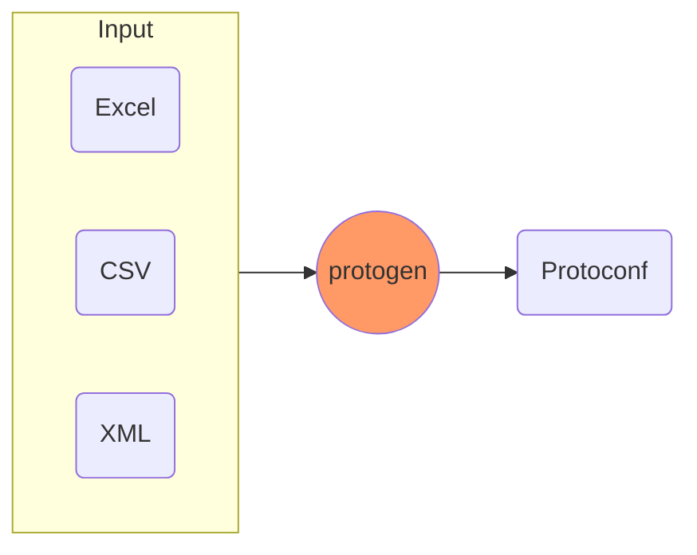
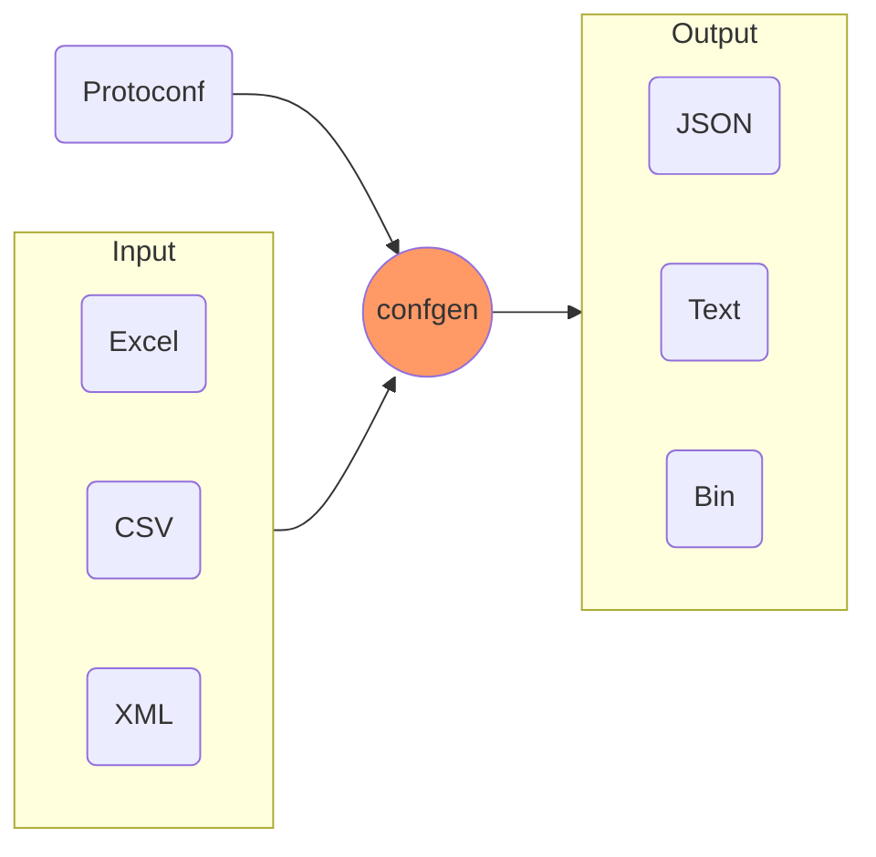

## tableauc

tableau命令行工具 `tableauc` 是 tableau 转换器（tableau converter）的缩写，主要由以下两个转换模块组成：

1. **protogen**：分析 Excel/CSV/XML/YAML 文件，提取文件结构信息，转换为 Protoconf 文件。
2. **confgen**：分析 Excel/CSV/XML/YAML 文件和对应的元信息文件 Protoconf，提取文件数据信息，转换为 JSON/Text/Bin 文件。

### protogen

`protogen` convert **Excel/CSV/XML/YAML** files to **Protoconf** files.
**Protoconf** is a dialect of [Protocol Buffers (proto3)](https://developers.google.com/protocol-buffers/docs/proto3) extended with [tableau options](https://github.com/tableauio/tableau/blob/master/proto/tableau/protobuf/tableau.proto), aimed to define the structure of Excel/CSV/XML/YAML.

### confgen

