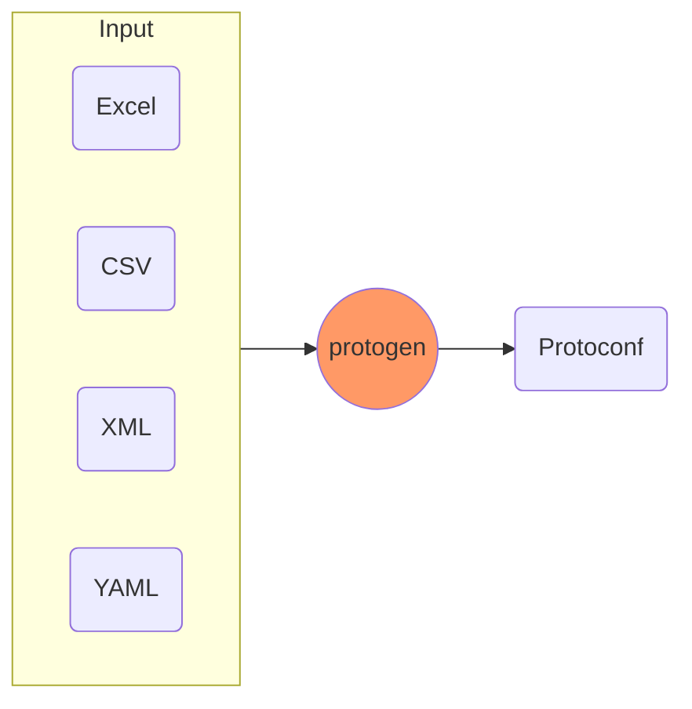
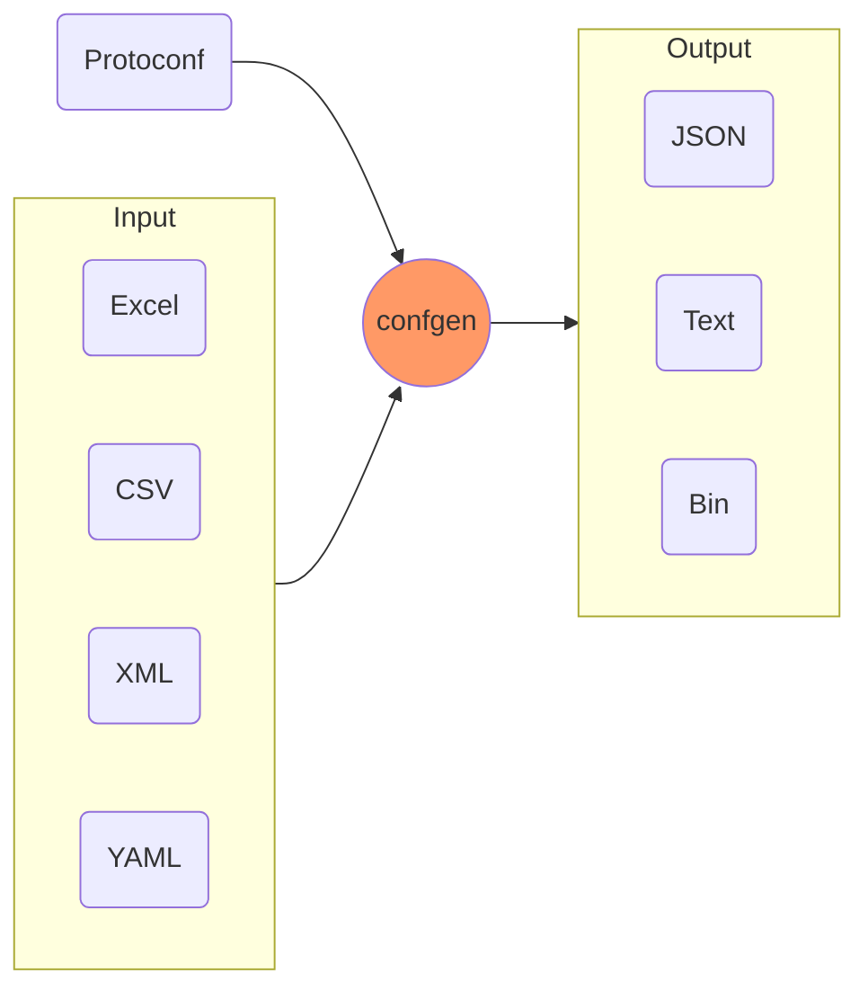

## tableauc

`tableauc` 是 **Tableau Compiler**（Tableau 编译器），内置 **protogen** 和 **confgen** 两个模块。

### protogen

`protogen` 将 **Excel/CSV/XML/YAML** 文件转换为 **Protoconf** 文件。
**Protoconf** 是 [Protocol Buffers (proto3)](https://developers.google.com/protocol-buffers/docs/proto3) 的一种方言，通过 [tableau options](https://github.com/tableauio/tableau/blob/master/proto/tableau/protobuf/tableau.proto) 进行扩展，用于描述 Excel/CSV/XML/YAML 的结构。

```mermaid
flowchart LR
  subgraph Input
    direction RL
    I1(Excel)
    I2(CSV)
    I3(XML)
    I4(YAML)
  end
  Input --> B
  B((protogen)):::orangecalss --> C(Protoconf)
  classDef orangecalss fill:#f96;
```

### confgen

`confgen` 将 **Excel/CSV/XML/YAML** 与 **Protoconf** 文件一起转换为 **JSON/Text/Bin** 文件。

```mermaid
flowchart LR
  subgraph Input
    direction RL
    I1(Excel)
    I2(CSV)
    I3(XML)
    I4(YAML)
  end
  
  Input --> B
  A(Protoconf) --> B
  B((confgen)):::orangecalss --> Output
  classDef orangecalss fill:#f96;
  
  subgraph Output
    direction RL
    O1("JSON")
    O2("Text")
    O3("Bin")
  end
```
